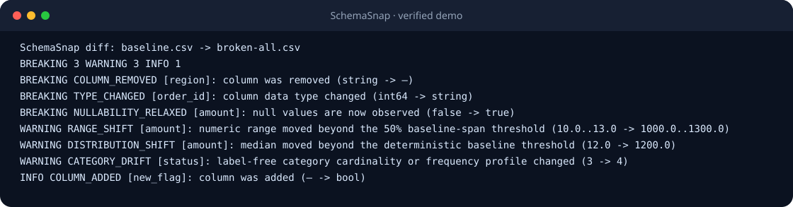

# SchemaSnap

**给数据做 Git diff。** SchemaSnap 把本地数据集快照成可提交到 Git 的安全统计，并用固定规则
识别契约漂移；不调用大模型，不上传数据，也不依赖云端服务。

[English](README.md) · [破损数据样例库](examples/gallery/README.md) ·
[隐私模型](docs/privacy.md) · [漂移规则](docs/drift-rules.md)



## 能做什么

- 读取 CSV、Parquet、Arrow IPC，以及受限的 DuckDB 只读 SQL。
- 快照列名、规范化类型、实际可空性、行数、空值率、去重数、唯一率、数值范围与分位数、
  时间范围/时区、无标签类别分布。
- 输出稳定的 `INFO`、`WARNING`、`BREAKING`，支持终端、Markdown、JSON。
- 快照绝不写入原始行、字符串样本、类别标签、SQL 原文、绝对路径、邮箱、姓名、用户 ID 或凭据值。
- `check` 的退出码适合 CI：`0` 通过，`1` 达到失败阈值，`2` 是配置/运行错误。

## 本地快速体验

需要 Python 3.12+ 和 [uv](https://docs.astral.sh/uv/)。

```bash
git clone https://github.com/hubugui1111-lab/schemasnap.git
cd schemasnap
uv sync --locked
uv run schemasnap snapshot examples/gallery/baseline.csv \
  -o demo-output/baseline.snap.json --force
uv run schemasnap diff demo-output/baseline.snap.json \
  examples/gallery/broken-all.csv --format markdown
```

完整复现二进制样例与 README 演示：

```powershell
./scripts/demo.ps1
```

## 三条核心命令

```bash
schemasnap init data.parquet
schemasnap diff .schemasnap/baseline.snap.json data.parquet
schemasnap check
```

默认只有 `BREAKING` 会让 `check` 返回 1。删除列、类型变化、新增空值、时区变化属于
`BREAKING`；大幅行数/范围/类别/分布变化属于 `WARNING`；新增列属于 `INFO`。规则详见
[漂移规则](docs/drift-rules.md)。

## 隐私取舍

类别统计只保存基数、熵和排序后的频率，不保存标签。因此，如果两个标签被两个新标签替换，
且频率完全一致，SchemaSnap 会有意不报告——这是为了避免把原始字符串永久写入 Git 历史。
列名属于契约的一部分，仍会保留；若列名本身机密，请不要公开快照。

## 安装名提醒

Python 发行包名是 **`schemasnap-data`**，导入包和命令仍是 `schemasnap`。PyPI 上已有的
`schemasnap` 是无关项目。在 README 正式宣布 PyPI 发布前，请从源码或 GitHub Release 的 wheel 安装，
不要执行 `pip install schemasnap`。

SchemaSnap 不是仪表盘、SaaS、数据目录、RBAC、调度器，也不替代 Great Expectations。它只专注于：
生成隐私优先的本地数据契约，并让差异进入代码审查。

